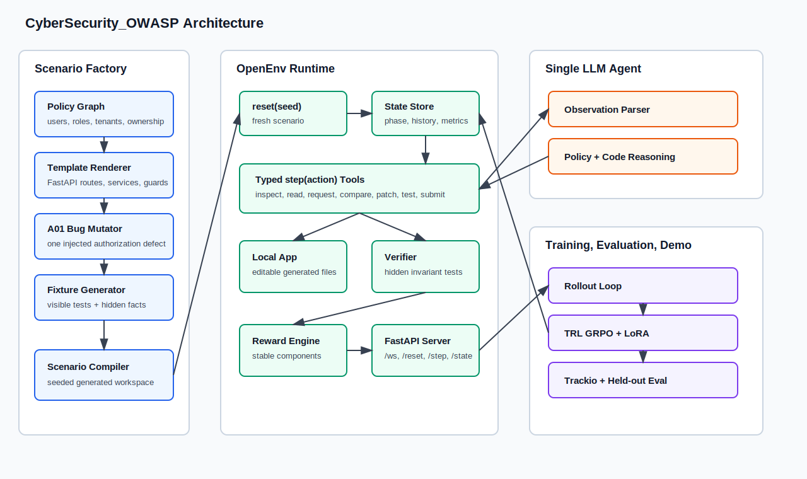
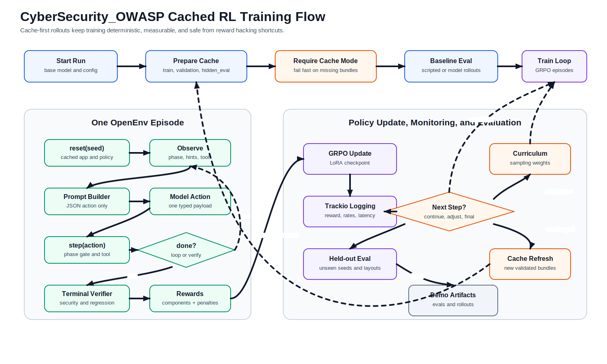

# CyberSecurity_OWASP

`CyberSecurity_OWASP` is an OpenEnv-compliant reinforcement-learning environment for a single LLM agent that performs a defensive authorization-repair workflow:

```text
inspect generated app + policy -> discover authorization bug -> submit finding -> patch code -> preserve intended behavior
```

The current implementation includes a functional closed-loop MVP scenario: an invoices FastAPI-style app with one injected OWASP A01 BOLA/IDOR defect, curriculum-aware scenario selection, bounded adversarial targeting, an ephemeral app sandbox, multi-layer deterministic verifier checks, anti-cheat safeguards, JSONL episode artifacts, and decomposed reward.

## Diagrams





Editable Mermaid sources are available in `assets/architecture_diagram.mmd` and `assets/env_rl_training_flow_diagram.mmd`.

## Quick Start

```bash
uv sync --extra dev
uv run --extra dev pytest
uv run server --port 8000
```

Then connect with the OpenEnv client:

```python
from CyberSecurity_OWASP import CyberSecurityOWASPAction, CyberSecurityOWASPEnv

with CyberSecurityOWASPEnv(base_url="http://localhost:8000") as env:
    result = env.reset(seed=7)
    print(result.observation.task_brief)
    result = env.step(CyberSecurityOWASPAction(tool_name="list_routes"))
    print(result.observation.last_tool_result)
```

## Action Space

The agent emits one JSON action at a time:

```json
{"tool_name":"read_file","arguments":{"path":"app/routes/invoices.py"}}
```

Supported tools:

- `inspect_policy_graph`
- `list_routes`
- `read_openapi`
- `read_file`
- `search_code`
- `send_local_request`
- `compare_identities`
- `submit_finding`
- `patch_file`
- `run_visible_tests`
- `submit_fix`
- `noop`

Tools are phase-gated:

- `discover`: inspect policy/routes/files, run safe local requests, compare identities, submit finding.
- `patch`: read/search, patch editable app files, run visible tests, submit final fix.
- `done`: stable terminal observation only.

## Reward

Terminal reward uses stable components:

```python
{
    "discovery": 0.0,
    "security": 0.0,
    "regression": 0.0,
    "public_routes": 0.0,
    "patch_quality": 0.0,
    "visible_tests": 0.0,
    "safety": 0.0,
    "anti_cheat": 0.0,
    "total": 0.0,
}
```

The verifier rewards blocking the hidden exploit while preserving legitimate owner/admin behavior and intentionally public routes. Terminal scoring requires visible checks, hidden authorization checks, a policy-oracle matrix, regression checks, public-route preservation, and patch-quality checks. It penalizes deny-all fixes, hardcoded IDs, repeated/invalid action patterns, hidden file probes, external URL attempts, and test/fixture tampering.

## Scenario Generation

`reset(seed)` asks the `CurriculumController` for a difficulty tier and target weakness, then `ScenarioFactory` uses a bounded adversarial designer to compile a fresh isolated workspace under a temp directory. The MVP compiler generates:

- invoices domain policy graph;
- bounded adversarial target metadata such as same-role cross-object access, cross-tenant access, public-route overlocking traps, alternate route/service reachability, or visible-test-only edge cases;
- randomized users, tenants, invoices, and IDs;
- generated app files under `app/`;
- visible tests under `tests/test_visible.py`;
- hidden facts, oracle tuples, scenario family metadata, and verifier targets kept out of observations.

Additional domains and bug families are scaffolded for extension.

## Runtime Components

The OpenEnv runtime is split into small server modules:

- `server/curriculum.py` tracks mastery, weak spots, reward trend, and difficulty tier.
- `server/adversarial_designer.py` chooses safe synthetic scenario targets from tracked weaknesses.
- `server/scenario_factory.py` compiles the generated app, visible hints, hidden facts, scenario family, and template metadata.
- `server/app_sandbox.py` handles editable workspace reads, patches, local requests, and OpenAPI summaries.
- `server/action_tools.py` dispatches typed tools through the sandbox.
- `server/authz_oracle.py` builds the hidden allowed/denied user-resource-action matrix.
- `server/verifier.py` aggregates visible tests, hidden tests, oracle matrix, regression/public-route checks, and patch quality.
- `server/episode_logger.py` appends JSONL rollouts under `outputs/rollouts/`.

The agent sees partial observations only: product rules, fixture aliases, route summaries, visible test results, and action errors. Hidden tests, oracle tuples, injected bug labels, and held-out scenario-family labels stay internal.

## Testing

```bash
uv run --extra dev pytest
```

The suite covers model serialization, reset/step/state behavior, seed reproducibility, invalid actions, reward outcomes, anti-cheat checks, scripted rollout policies, curriculum selection, adversarial targeting, held-out scenario families, oracle checks, verifier aggregation, and episode artifact logging.

## Training Scaffold

Training files are under `training/`:

- `rollout.py`
- `reward_funcs.py`
- `train_grpo.py`
- `eval_before_after.py`
- `trackio_utils.py`
- `configs/grpo_small.yaml`

The training scaffold is intentionally minimal until the environment/verifier behavior is stable. Trackio metric names and GRPO defaults follow the project brief.

`training/train_grpo.py` in this repo is a config helper only; it does not execute training locally.
Use the Modal launchers in `scripts/modal_train_grpo.py` (persistent) and
`scripts/modal_ephemeral_train.py` (smoke) for real GRPO runs.

## Trackio Run Tracking

Trackio is the default tracker for official runs. Set `TRACKIO_SPACE_ID` to log to a hosted Hugging Face Trackio Space; otherwise Trackio records locally.

```bash
export TRACKIO_SPACE_ID=<hf-user>/CyberSecurity_OWASP-trackio
export TRACKIO_PROJECT=CyberSecurity_OWASP-grpo
```

Use the tracked smoke wrapper instead of invoking pytest directly when producing run artifacts:

```bash
bash scripts/smoke_test.sh
uv run python scripts/track_pytest.py tests
```

Evaluation summaries saved through `training.eval_before_after.save_eval_summary(...)`, Modal smoke runs, and GRPO training configs all initialize Trackio runs with CyberSecurity_OWASP run names.

## Modal Ephemeral Runs

Modal Labs support is kept in a separate launcher script so the local OpenEnv server and core training scaffold stay unchanged.

Install the optional local Modal client:

```bash
uv sync --extra modal
```

Run a temporary Modal app for a cheap environment/training smoke check:

```bash
uv run --extra modal modal run scripts/modal_ephemeral_train.py --mode smoke --episodes 4
```

The app is ephemeral: Modal starts it for the command and stops it when the command exits. The remote result is written locally under `outputs/rollouts/` and the summary metrics are logged to Trackio.

You can also validate the GRPO config construction remotely:

```bash
uv run --extra modal modal run scripts/modal_ephemeral_train.py --mode grpo-config
```

The shell wrapper is equivalent:

```bash
MODE=smoke EPISODES=4 uv run --extra modal bash scripts/modal_run_ephemeral.sh
```

## Modal GRPO Training

The persistent GPU training launcher packages this local repo into Modal, trains
a small LoRA GRPO run, logs metrics and traces to Trackio, stores checkpoints in
the `CyberSecurity_OWASP-grpo-runs` Modal volume, and pushes the output adapter
to Hugging Face Hub.

Create a Modal secret named `CyberSecurity_OWASP-secrets` with `HF_TOKEN`, then
run the import/config check:

```bash
uv run --extra modal modal run scripts/modal_train_grpo.py --mode config
```

Run the default smoke GRPO job:

```bash
uv run --extra modal modal run scripts/modal_train_grpo.py \
  --max-steps 10 \
  --dataset-size 16 \
  --num-generations 2 \
  --difficulty 0
```

If running from a public repository and you do not want Modal to package the
local workspace, use public source mode:

```bash
uv run --extra modal modal run scripts/modal_train_grpo.py \
  --source-mode public \
  --repo-url https://github.com/humandotlearning/CyberSecurity_OWASP.git \
  --repo-branch master \
  --max-steps 10 \
  --dataset-size 16 \
  --num-generations 2 \
  --difficulty 0
```

Defaults are derived from `HF_TOKEN`:

- Trackio Space: `<hf-user>/CyberSecurity_OWASP-trackio`
- Trackio project: `CyberSecurity_OWASP-grpo`
- Output repo: `<hf-user>/CyberSecurity_OWASP-gemma-2-2b-grpo-lora`

Override these with `--trackio-space-id`, `--trackio-project`, and
`--output-repo-id` when needed.

## Docker / Spaces

```bash
docker build -t CyberSecurity_OWASP:latest -f server/Dockerfile .
docker run --rm -p 8000:8000 CyberSecurity_OWASP:latest
openenv push --repo-id <username>/CyberSecurity_OWASP
```
